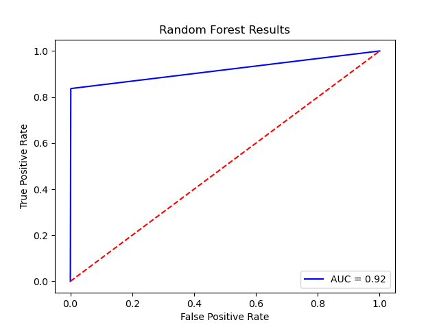
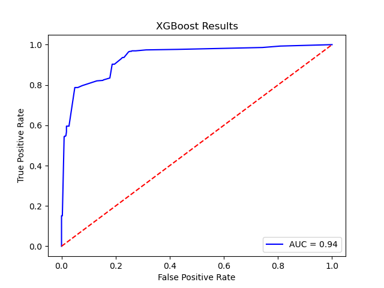

<!-- PROJECT TITLE -->
## Classification example
In this project, we will address a typical kind of data problem called the Classification Model. In this case, it is expected to predict, given a set of observations (dataset), if a phenomenon will occur or not (output information) according to a set of parameters (input information). For instance, we may want to predict when a customer will leave our online subscription or when our employees will leave the company.

Notably, in this example, we will design a model to predict employee attrition in a company using a dataset provided by this video example. Firstly, we will import the dataset and ensure the data quality data is correct. Secondly, we will perform an exploratory data analysis (EDA) to provide insights into the nature of the data. Finally, we will train two kind of models (Random Forest and XGBoost) and we will compare their performance.

<!-- RESULTS -->
## Results

Both models predict with good accuracy whether the employee will leave or not the company. However, considering the Area Under Curve (AUC) of the ROC curve as metric to asses the quality of the binary classifier, the XGBoost-model is better.

